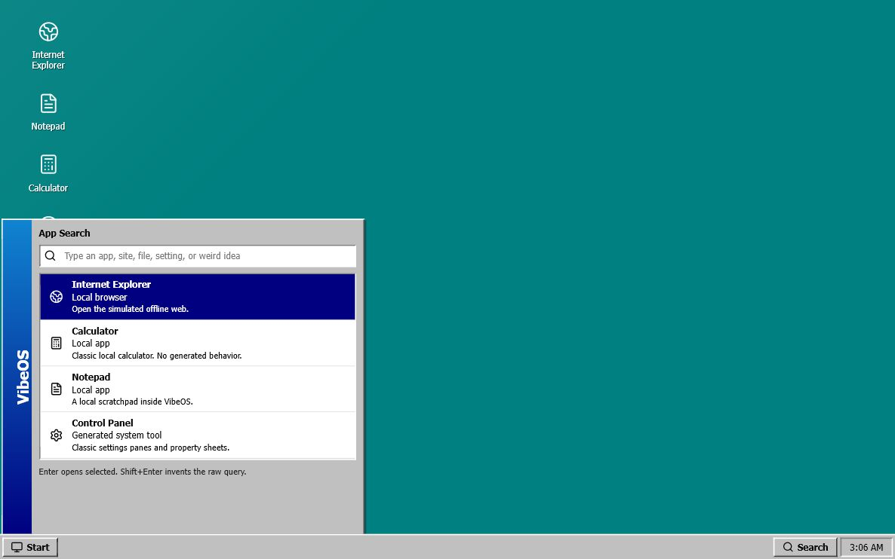
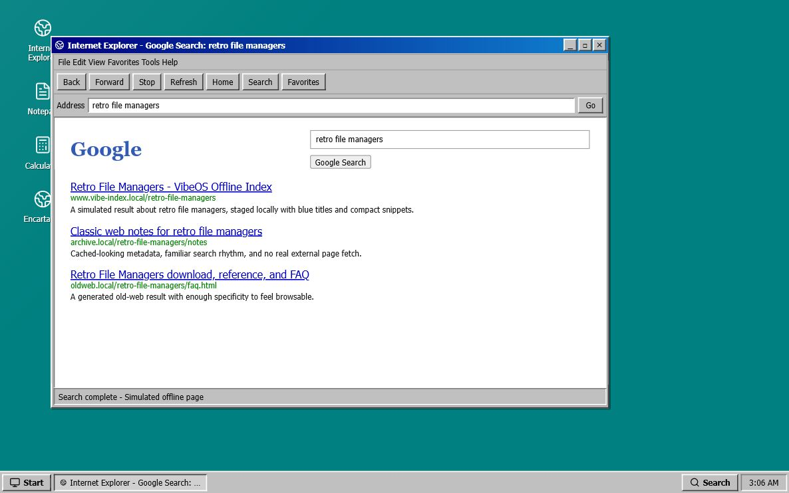
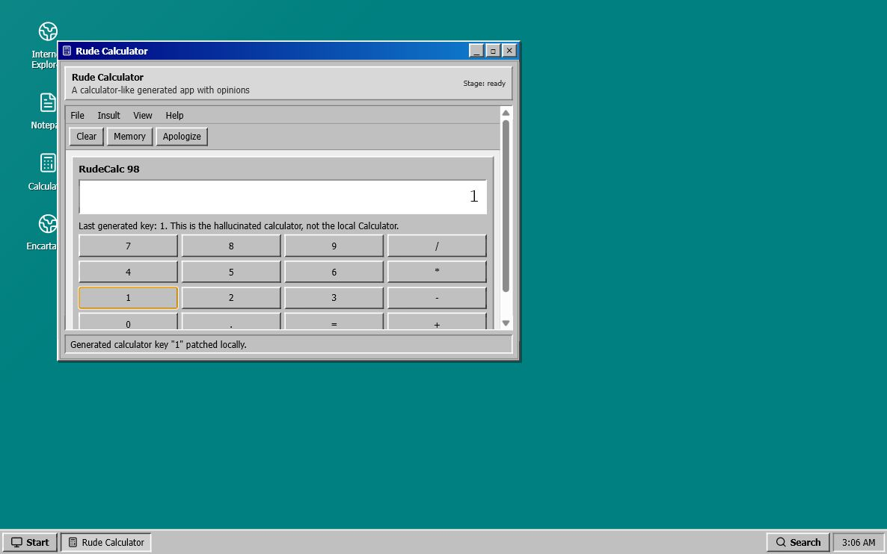

# VibeOS

VibeOS is a retro Windows-like hallucinated operating system prototype. It opens a fast local shell first, then fills browser pages and generated apps with deterministic, validated facsimiles instead of real web pages, iframe content, or model-provided HTML.

The point is stage-demo plausibility: a local desktop, Internet Explorer-style browser chrome, generated old-software windows, fake documents, and event-driven app surfaces that feel immediate.

## Screenshots

### App Search



### Simulated Browser Search



### Generated App Interaction



## What Works

- Windows 98-style desktop shell, taskbar, Start/App Search, desktop icons, and movable windows.
- Local runtimes for Calculator, Notepad, and Internet Explorer chrome.
- A simulated browser page surface for Google-like search results, Example Domain, Wikipedia-like articles, Encarta-like pages, and old-web facsimiles.
- Generated apps built from a validated block tree and patch stream.
- Typed event intents for generated interactions, such as To Do row selection and generated calculator key presses.
- Deterministic mock providers and cache hydration so the prototype can run without model latency.

## Run Locally

Install dependencies:

```bash
bun install
```

Start the dev server:

```bash
bun run dev
```

Open:

```text
http://127.0.0.1:5173/
```

## Useful Scripts

```bash
bun run typecheck
bun run build
```

## Try These Prompts

- `internet explorer`
- `example.com`
- `retro file managers`
- `todo`
- `rude calculator`
- `Encarta 98 about Mark Russinovich`
- `nested os`

Use `Enter` in App Search to launch the selected result. Use `Shift+Enter` to force the raw query into a generated app.

## Architecture Map

The app is a small client-side runtime simulator:

- `src/runtime/kernel.ts` owns dispatch, state, snapshots, and subscriptions.
- `src/runtime/windowManager.ts` owns window geometry, focus, z-order, and modes.
- `src/runtime/shellRuntime.ts` owns App Search and shell state.
- `src/runtime/browserRuntimeHost.ts` owns local browser chrome state, history, and page navigation.
- `src/runtime/generatedRuntime.ts` defines generated documents, block validation, patch streams, and facsimile routes.
- `src/runtime/generatedRuntimeHost.ts` applies generated runtime ticks and typed UI events.
- `src/App.tsx` renders snapshots and dispatches user events back into the runtime.

See `docs/DESTRUCTIVE_REWRITE_SPEC.md` for the full product and architecture brief.
